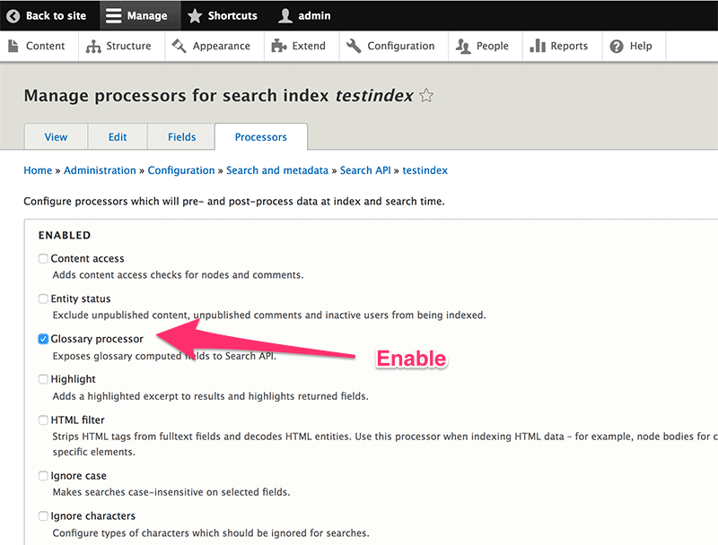
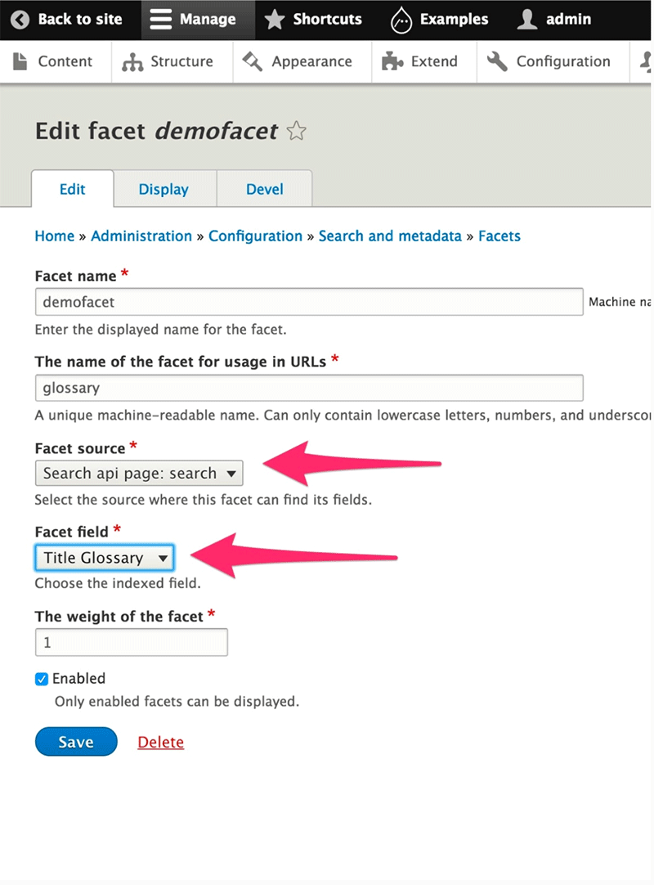
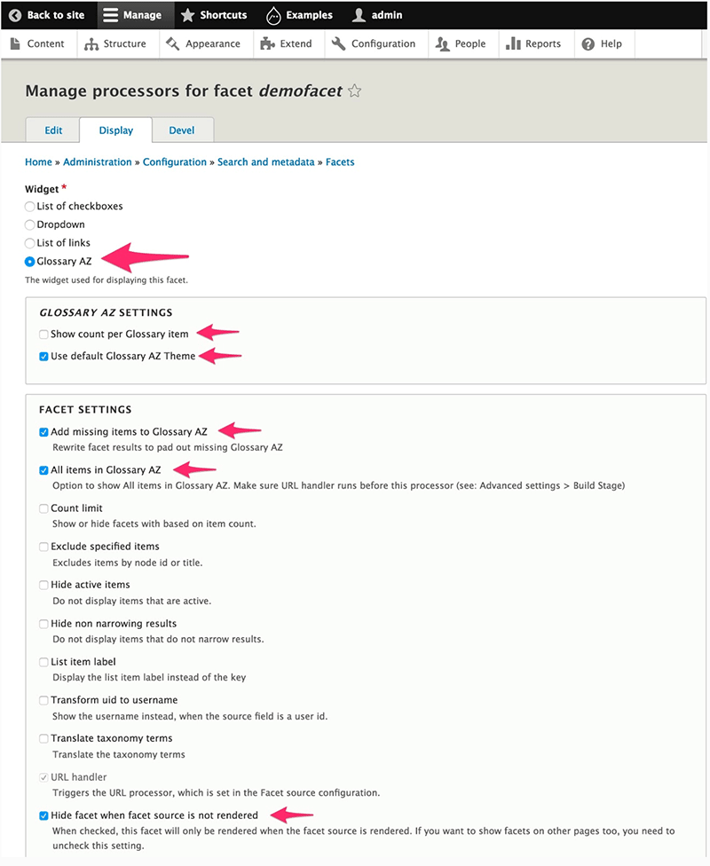
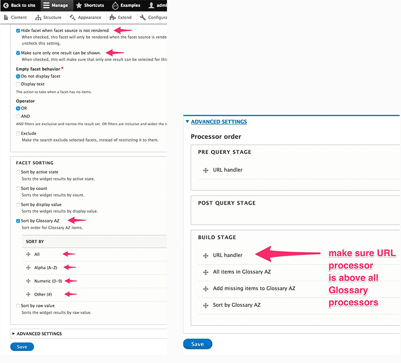

# Glossary AZ Search

## Search API Configuration

### 1: Enable Glossary option on Search API Index
* Edit the Search API Index where you wish to add Glossary AZ Search Option
* Enable Glossary option on required field(s)
* Configure Glossary Grouping
* Save

Glossary AZ Search module will automatically create a new pseudo field to store the index value.

### 2: Add the Glossary Pseudo field
* Add Glossary Field(s) to the Index
* Click Done

### 3: Confirm and save the Index
* Confirm the changes
* Save the Index
* Re-Index so the Glossary Pseudo field can be added to the Index.

## Facet Configuration

### 1: Create a new facet
* Create new facet
* Select Source Backend
* Select Glossary Field

### 2: Configure the new facet
* Configure facet
* Save facet
* After saving, the facet is available as a block

## Enable & Configure the Block
* Enable and configure the block

